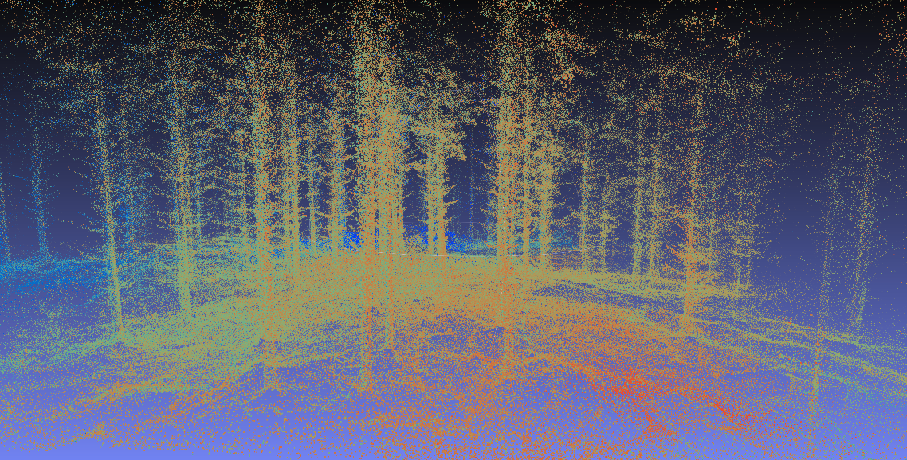

## auto2-ros: Workspace for the AUTO2 autonomous forestry research project

### Setup instructions
This section is meant to help new users get up and running quickly, so please add any added dependencies here.   

Nominal configuration: ubuntu 16.04 LTS & ROS Kinetic   
https://www.ubuntu.com/download/alternative-downloads   
http://wiki.ros.org/kinetic/Installation   

### Devel instructions
We recommend using QTcreator https://ros-qtc-plugin.readthedocs.io/en/latest/ main IDE.

### Run instructions
This section is for instructions on how to run data logging, experiments, simulations etc.
